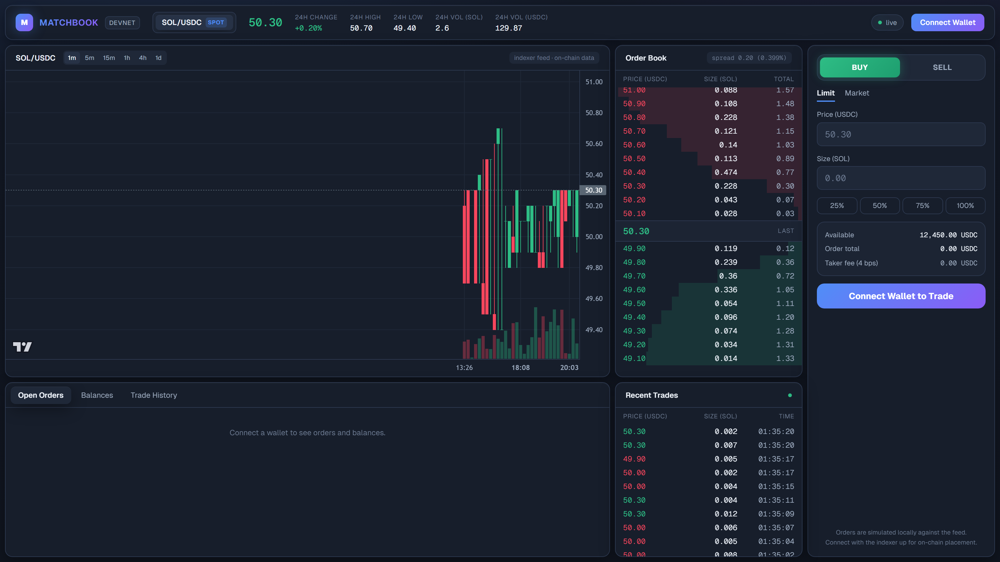
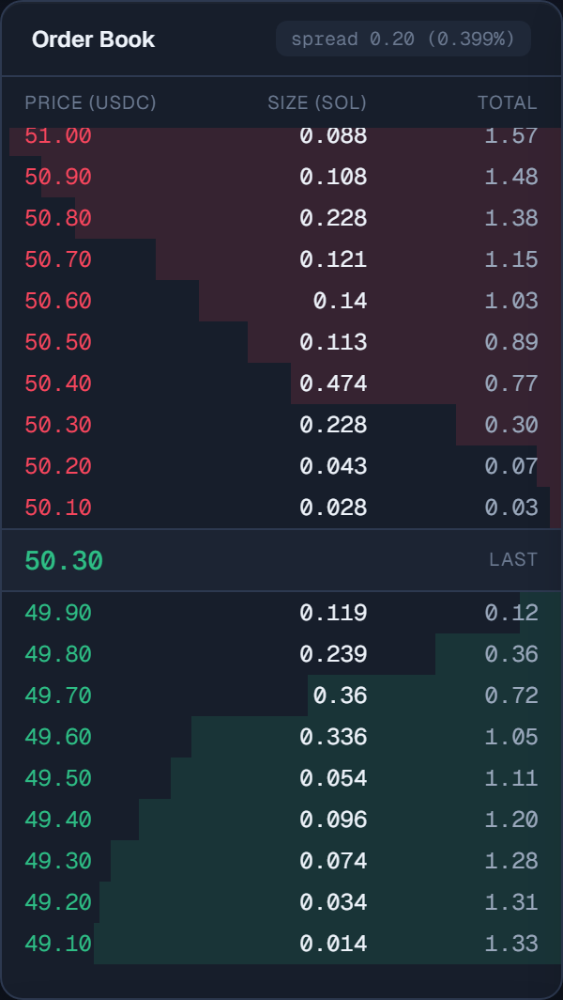
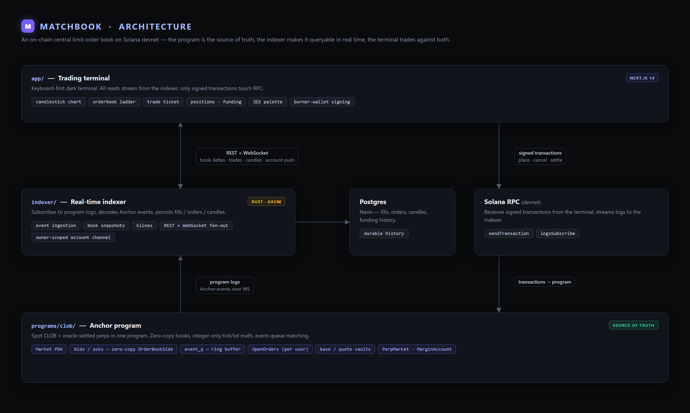
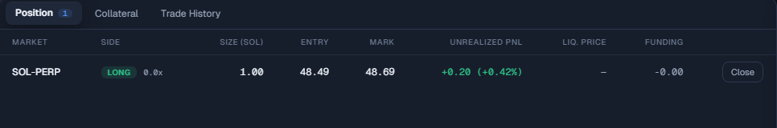
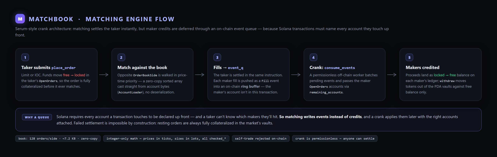

# Matchbook

A central limit order book DEX on Solana, built end-to-end: an on-chain
matching engine and perpetual futures risk engine (Anchor/Rust), an
off-chain indexer (Rust), keeper bots, and a professional trading
terminal (Next.js) — from raw program design to a deployed live stack.

**Live demo:** <https://iiitmanjeet.github.io/matchbook/> — real devnet
data end to end: the terminal streams the order book, trade tape and
candles from a hosted indexer tailing the on-chain program.

**Program ID (devnet):** `9bezj1VAw4gTMKonswkKioRdsttD4UowXh87Fcw9Wtr2`



<p align="center">
  
</p>
<p align="center"><em>Live order book — depth bars per level, spread readout, click any row to load the price into the ticket.</em></p>




<p align="center"><em>Perp position panel — netted position with VWAP entry, mark-to-market PnL and funding accrual.</em></p>



## Highlights

- **On-chain CLOB** — markets with PDA token vaults, free/locked balance
  accounting that keeps every resting order fully collateralized by
  construction, and price-time-priority matching (limit / post-only /
  IOC) with price improvement and taker fees. Fills flow through an
  on-chain **event queue** settled by a permissionless `consume_events`
  crank — the Serum architecture, built from scratch.
- **Perpetual futures** — oracle-priced SOL-PERP margined in USDC:
  netted positions with VWAP entry, settle-funding-first invariants,
  funding accrued from open-interest skew via a permissionless crank,
  and permissionless liquidations with a split penalty.
- **Zero-copy order book accounts** (the ~7 KB book is cast in place,
  never deserialized) and integer-only tick/lot math with checked
  arithmetic throughout.
- **Rust indexer** (tokio + Axum) — websocket log ingestion into
  Postgres with restart-safe backfill, live in-memory book
  reconstruction from events alone, 1-minute candles, and a REST +
  websocket API. Speaks raw JSON-RPC — no `solana-sdk` dependency.
- **Trading terminal** — dense dark-terminal UI with TradingView
  candles, a depth-visualized ladder, and a ticket that signs real
  `place_order`/`cancel_order` transactions. Roles (operator / trader /
  viewer) are derived from on-chain state; perp mode adds positions,
  margin math and collateral management behind a market switcher.
- **Keeper bots** — a market seeder and a combined oracle pusher /
  funding cranker / liquidator that mirrors the on-chain equity math.
- **Tests at every layer** — Anchor integration suite, indexer unit
  tests (event decoding, book reconstruction), frontend unit tests, and
  puppeteer end-to-end flows for both spot and perps.

## Architecture

```
 Next.js terminal ──REST/WS──▶ Rust indexer ──▶ Postgres
        │                          ▲
        └────tx signing────▶ Solana RPC ◀──logs┘
                                   │
                     Anchor program (source of truth)
```

See [docs/ARCHITECTURE.md](docs/ARCHITECTURE.md) for the account model
and the reasoning behind each design decision, and
[docs/DEPLOY.md](docs/DEPLOY.md) for how the live stack
(GitHub Pages → Render → Neon → devnet) is wired.

## Repository layout

```
programs/clob/    Anchor program — markets, vaults, orderbook, perps
indexer/          Rust service: event ingestion → Postgres → REST + WS
app/              Next.js trading terminal
scripts/          Keeper bots: market seeder, oracle/funding/liquidation
tests/            Anchor integration tests
docs/             Architecture and deployment docs
```

## Running locally

Prerequisites: Solana CLI + Anchor 0.31 (Linux or WSL), Rust ≥ 1.85,
Node ≥ 18, Docker.

```bash
# Linux/WSL — build, run a local cluster, deploy
anchor build
solana-test-validator
anchor deploy
```

```bash
npm test                          # Anchor integration suite (repo root)

cd indexer
docker compose up -d              # Postgres on localhost:5433
cargo run                         # backfill + live tail → http://127.0.0.1:8081
cargo test                        # decoding + book reconstruction

node scripts/seed-market.mjs 5    # spot: market, resting grid, 5 min of trades
node scripts/perp-keeper.mjs 10   # perps: oracle + funding crank + liquidator

cd app
npm run dev                       # terminal on http://localhost:3000
npm test                          # unit tests
npm run test:e2e:sign             # e2e: connect → rest bid → lock → cancel → buy
npm run test:e2e:perps            # e2e: long SOL-PERP → verify position → close
```

The terminal probes the indexer on load and falls back to a built-in
simulator feed when it's unreachable, so the UI is explorable with
nothing else running.
